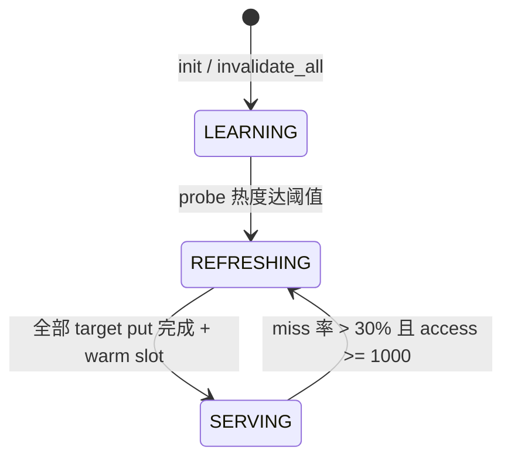
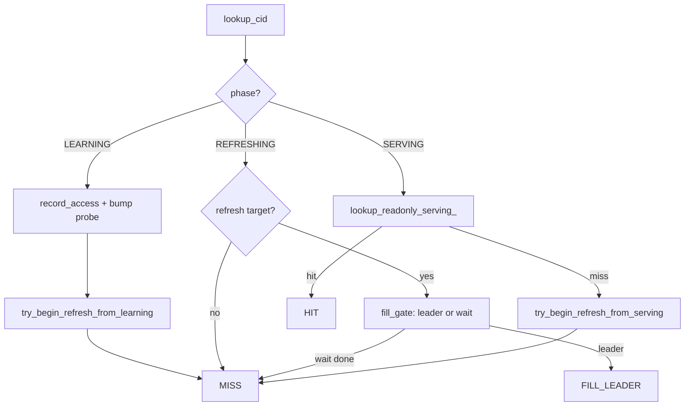

# IVF CID Cluster Cache：设计与实现

本文描述 `ObIvfCidClusterCache`（逻辑层）与 `ObIvfCidClusterKVCache`（物理层）的**当前实现**，供开发与 Code Review 使用。

核心思路：**查询路径只关心 HIT / MISS / FILL_LEADER**；cache 内部用三阶段状态机控制可见性与写入；SERVING 阶段只读、无 query-time pin 写。

---

## 1. 目标与分层

| 层级 | 组件 | 职责 |
|------|------|------|
| DAS | `ObDASIvfCidVecCacheScanIter` | REPLAY / FILL / MISS；一次 `lookup_cid` 决定模式 |
| 逻辑 | `ObIvfCidClusterCache` | 三阶段状态机、refresh target、ledger 字节账、warm slot |
| 物理 | `ObIvfCidClusterKVCache` | ICFL flat blob 存取；LRU/wash 由全局 `ObKVCache` 负责 |

DAS **不再**分步调用 `try_pin` / `bump_probe` / `acquire_cid_cluster`；所有 phase 逻辑封装在 `lookup_cid` 内。

---

## 2. 三阶段状态机

`cache_phase_`（atomic）控制 cache 对查询的可见性：

| Phase | 查询可见 | `lookup_cid` 行为 | `put` |
|-------|----------|-------------------|-------|
| **LEARNING** | 否 | 记录 probe heat；恒 **MISS** | 拒绝 |
| **REFRESHING** | 否 | refresh target → **FILL_LEADER** / wait；其余 **MISS** | 允许 |
| **SERVING** | 是 | 只读 **HIT** / **MISS** | 拒绝 |



### 2.1 LEARNING → REFRESHING

触发：`try_begin_refresh_from_learning_()`（每次 LEARNING 阶段的 `lookup_cid` 末尾尝试）。

条件：

- `probe_heat_map_` 中至少有一个 CID 的 `access_cnt >= FILL_MIN_PROBE`（默认 5，见 §10）。
- CAS `LEARNING → REFRESHING` 成功。

动作：`prepare_refresh_targets_(false)` — 从 probe heat 中选 top-K（按 `heat_score_` 降序），写入 `refresh_target_map_`（value: 0=pending, 1=done）。

若 top-K 为空，CAS 回 `LEARNING`。

### 2.2 REFRESHING → SERVING

每个 target CID 在 DAS `flush_building_cluster` 成功 `put` 后调用 `notify_refresh_put_done(cid)`：

1. `mark_refresh_target_done_` — 标记 done，`refresh_targets_remaining_--`。
2. `try_finalize_refresh_if_complete_` — 当 remaining==0：
   - `warm_readonly_pin_slots_()` — 对每个 done target 调用 `warm_pin_slot_`。
   - CAS `REFRESHING → SERVING`。

### 2.3 SERVING → REFRESHING

触发：`try_begin_refresh_from_serving_()`（SERVING miss 后尝试）。

条件：`total_access_samples_ >= 1000` 且 `serving_miss_samples_ * 100 / access >= 30`。

动作：`prepare_refresh_targets_(true)` — 从 `ledger_map_` 按热度选 top-K；CAS `SERVING → REFRESHING`。

### 2.4 invalidate_all

- `current_index_epoch_++`；清 pin_map / ledger / probe_heat / fill_gates / refresh_target_map。
- `store_phase_(LEARNING)`；重置 access/miss 计数。

索引 tablet 级：`invalidate_ivf_cid_cluster_cache_for_index_tablet` → 按 mgr key 找实例并 `invalidate_all()`，**不销毁** cache 对象。

---

## 3. 核心数据结构

### 3.1 逻辑层 Map

```
probe_heat_map_      : cid -> ObIvfCidClusterHeat   // LEARNING 阶段访问热度
ledger_map_          : cid -> { bytes_, heat_ }      // 逻辑字节账（可与 KV 短暂漂移）
pin_map_shards_[64]  : cid -> PinSlot*               // warm view；cid%64 分片锁
fill_gates_          : cid -> ObIvfCidFillGate*      // REFRESHING 单 CID 单 FILL leader
refresh_target_map_  : cid -> int8_t                 // 0=pending, 1=done
```

锁：

| 锁 | 保护 |
|----|------|
| `ledger_lock_` | ledger、evict、put 账面 |
| `probe_heat_lock_` | probe_heat_map_ |
| `fill_gates_lock_` | fill_gates_、refresh_target_map_ |
| `pin_shard_locks_[cid % 64]` | 对应 pin_map 分片 |

无全局 cache 锁；`current_index_epoch_`、`cache_phase_`、stats 计数器用 atomic。

### 3.2 PinSlot（warm slot，非 query pin）

```cpp
struct ObIvfCidClusterPinSlot {
  ObIvfCidClusterEntry *view_entry_;   // attach 后的 REPLAY view
  ObObj *rowkey_objs_;
  ObKVCacheHandle kv_handle_;          // 保活 KV flat
};
```

- **无 `pin_cnt_`**：slot 仅为跨 query 的只读 warm cache，SERVING 阶段 **borrow** 时不写 pin_map。
- 安装：`warm_pin_slot_` → `load_kv_pin_prep_` + `install_pin_slot_locked_`（REFRESHING 结束或 evict/put 前替换）。
- 释放：`release_dormant_pin_shard_locked_` / `ledger_remove_` / `invalidate_all`。

### 3.3 Entry 形态

| 形态 | 标志 | `arena_` | KV handle | 释放 |
|------|------|----------|-----------|------|
| FILL building | — | 非空 | — | `discard_building_cluster` |
| SERVING borrowed | `session_borrowed_` | 空 | slot 内 | `release_session_entry`（noop） |
| SERVING owned | `session_owned_` | 空 | `session_kv_handle_` | `release_session_entry`（delete shell） |

`payloads_l2_unit_known_` / `payloads_l2_unit_`：FILL 首行探测写入 flat header；REPLAY attach 时恢复。

### 3.4 Flat KV Value（ICFL）

文件：`ob_ivf_cid_cluster_kv_cache.{h,cpp}`

```
ObIvfCidFlatHeader
  magic/version, index_epoch, cid, row_count, entry_bytes, heat
  payload_type
  reserved_[0] : payloads_l2_unit_known
  reserved_[1] : payloads_l2_unit

[offset 表] payload_off/len, rowkey_off/len（每行）
[data] payload 原始字节 + rowkey 序列化 blob
```

- **PUT**：`ivf_cid_flat_encode_entry` → `put_flat` → memblock 内一次 memcpy。
- **GET**：`get_flat` + `ivf_cid_flat_attach_entry` — payload 指针指向 KV 内地址（零拷贝）；rowkey 反序列化到独立 `ObObj` 数组。

Key：`ObIvfCidClusterKVKey(mgr_key_, cid)`。

---

## 4. DAS 集成

### 4.1 ScanMode

| 模式 | `lookup_cid` 结果 | 行为 |
|------|-------------------|------|
| **REPLAY** | HIT | 无 storage iter；`replay_*` 物化行 |
| **FILL** | FILL_LEADER | storage scan → `append_fill_row` → `put` |
| **MISS** | MISS | 委托 `ObDASScanIter` 读 storage |

### 4.2 CID 切换流程

```
on_cid_switch
  → flush_building_cluster()     // FILL leader put + finish_cid_fill + notify_refresh_put_done
  → release_replay_entry()       // release_session_entry
  → lookup_cid(new_cid)
  → 设置 ScanMode
```

### 4.3 flush_building_cluster

1. `cluster_cache_->put(building_cluster_)` — 仅 REFRESHING 阶段成功。
2. 成功 → `notify_refresh_put_done(fill_cid)`。
3. `finish_cid_fill(fill_cid)` — 唤醒 fill gate waiter。
4. `discard_building_cluster()`。

---

## 5. lookup_cid（对外唯一入口）



### 5.1 SERVING：`lookup_readonly_serving_`

1. **Borrow warm slot**（持 pin 分片锁）  
   slot 存在且 `index_epoch` 一致 → 返回 `view_entry_`，设 `session_borrowed_=true`。无 pin 写、无 ledger 写。

2. **KV get + session-owned attach**（锁外 get）  
   `load_kv_pin_prep_` → 设 `session_owned_=true`，KV handle 移到 `entry->session_kv_handle_`。

3. **Miss**  
   `get_miss_cnt_++`，`serving_miss_samples_++`。

### 5.2 REFRESHING：`lookup_cid_refreshing_`

- 非 `refresh_target_map_` 中的 CID → MISS。
- Target CID：fill gate 逻辑（单 leader；waiter 在 `finish_cid_fill` 唤醒）。
- 查询**不会**在 REFRESHING 得到 HIT（cache 对查询不可见）。

### 5.3 LEARNING

- `record_access_`：`total_access_samples_++`；`bump_probe_heat_locked_`。
- 恒 MISS；不读 KV、不写 pin_map。

---

## 6. put（仅 REFRESHING）

```
phase != REFRESHING  → OB_STATE_NOT_MATCH
容量不足            → OB_BUF_NOT_ENOUGH（ledger_evict_until）
entry.index_epoch_ != current_index_epoch_ → OB_STATE_NOT_MATCH
```

流程：

1. 释放该 CID 已有 warm slot（若有）。
2. `ledger_remove_locked_(cid, false, false)` — 仅 drop 账面，不 `erase_key`（避免与并发 `get_flat` 竞态）。
3. `ivf_cid_flat_encode_entry` → `put_flat(overwrite)` → `ledger_put`（合并 probe heat）。
4. `clear_probe_heat_locked_(cid)`。

**不在 put 时 warm pin**；warm 统一在 `finalize_refresh_to_serving_` → `warm_pin_slot_`。

### 6.1 ledger 驱逐

`ledger_bytes_ + entry_bytes_ > max_bytes_` 时：

1. 新 CID 热度须严格高于当前最冷 ledger 条目，否则 `OB_BUF_NOT_ENOUGH`。
2. 循环选最冷 victim → 释放 warm slot + `ledger_remove_locked_(count_evict=true)`（含 `erase_key`），直到有空间。

KV **wash** 额外淘汰时，ledger 可能残留直至 SERVING miss → `reconcile_kv_pin_miss_locked_` / `ledger_remove` heal。

---

## 7. REPLAY 零拷贝与 L2 Normalize

### 7.1 物化

`materialize_row_to_eval`：`payload_datum.set_string(row.payload_, row.payload_len_)` — 不 memcpy payload。

### 7.2 COSINE + cache header

FILL 首行 `ivf_cid_probe_payloads_l2_unit` 结果写入 flat `reserved_[0/1]`。

REPLAY 时若 header known 且 payloads 已 L2 单位化 → 跳过 per-row norm scratch（真零拷贝）。

| 场景 | scratch | norm |
|------|---------|------|
| REPLAY + header 已单位向量 + COSINE | 无 | 无 |
| REPLAY + header 需 norm | 有 | 有 |
| REPLAY + 旧 blob（reserved 未设） | 首行探测 | 按探测结果 |
| MISS（storage） | 原 IVF 逻辑 | 原 IVF 逻辑 |

### 7.3 避免写穿 KV

COSINE 且需 norm 时：向量 memcpy 到 query arena 再原地 L2_normalize，**不修改** KV flat 内 payload。

---

## 8. 并发与锁设计

| 路径 | 锁 | 说明 |
|------|-----|------|
| SERVING borrow slot | pin 分片锁 | 只读；微秒级 |
| SERVING KV miss→owned | 无 cache 锁 | KV get 在锁外；owned entry 由 query 持有 handle |
| REFRESHING fill gate | fill_gates_lock_ | 仅 target CID |
| put / evict | ledger_lock_ + pin 分片锁 | 非查询热路径 |
| phase 转换 | atomic CAS | 无全局锁 |

**已移除**：query-time `pin_cnt` 递增、online `should_admit_fill`、put 时 `OB_EAGAIN`（pin 冲突）、`try_switch_to_replay_after_put_conflict`。

---

## 9. Mgr 生命周期（跨 query）

`g_ivf_cid_cluster_cache_mgr_map` 按 `ObIvfCidClusterCacheMgrKey` 持有单例 cache：

| 引用 | +1 | -1 |
|------|----|----|
| mgr 常驻 | 首次 insert map | map erase 且 ref==0 → destroy |
| iter holder | `acquire_ivf_cid_cluster_cache` | `release_ivf_cid_cluster_cache` |

iter release 后 cache 仍留在 map 中，probe heat / ledger / warm slot 可跨 query 积累；LEARNING 阶段由此能累积足够热度触发首次 REFRESHING。

---

## 10. 环境变量

| 变量 | 默认 | 含义 |
|------|------|------|
| `OB_IVF_CID_CLUSTER_CACHE_ENABLED` | on | 总开关 |
| `OB_IVF_CID_CLUSTER_CACHE_STATS` | on | 统计日志 |
| `OB_IVF_CID_CLUSTER_CACHE_FILL_MIN_PROBE_ACCESS` | 5 | LEARNING 阶段 CID 成为 hot 的最小 access 次数；也是 refresh target 候选门槛 |
| `OB_IVF_CID_CLUSTER_CACHE_FILL_TOP_K` | 24 | 每轮 refresh 的 target CID 上限（可按 max_bytes 估算） |
| `OB_IVF_CID_CLUSTER_CACHE_STATS_EVERY_N_CID` | 0 | per-CID 进度日志间隔（0=关闭） |
| `OB_IVF_LATENCY_BREAKDOWN` | off | 延迟 breakdown |
| `OB_IVF_LATENCY_BREAKDOWN_SAMPLE_EVERY_N` | 0 | 采样间隔 |

---

## 11. 统计字段

`ObIvfCidClusterCacheStats` 主要计数器（atomic）：

| 字段 | 含义 |
|------|------|
| `get_hit_cnt_` / `get_miss_cnt_` | SERVING 只读 lookup |
| `put_ok_cnt_` / `put_fail_cnt_` | REFRESHING put |
| `fill_wait_cnt_` | REFRESHING fill gate 等待 |
| `phase_*_cnt_` | 阶段转换次数 |
| `invalidate_cnt_` | invalidate_all 次数 |
| `evict_entry_cnt_` / `evict_bytes_` | ledger 驱逐 |

`fill_bypass_cnt_` 保留字段（旧 online admit 路径已删除，不再递增）。

---

## 12. 源码索引

| 文件 | 说明 |
|------|------|
| `src/share/vector_index/ob_ivf_cid_cluster_cache.{h,cpp}` | 逻辑层：phase、lookup、put、warm slot |
| `src/share/vector_index/ob_ivf_cid_cluster_kv_cache.{h,cpp}` | ICFL flat + KV |
| `src/sql/das/iter/ob_das_ivf_cid_vec_cache_scan_iter.{h,cpp}` | DAS REPLAY/FILL/MISS |
| `src/sql/das/iter/ob_das_ivf_scan_iter.cpp` | L2 norm + `get_cached_payloads_l2_unit` |
| `src/sql/das/iter/ob_das_iter_utils.cpp` | 创建 cache iter |

---

## 13. 已知限制

| 项 | 说明 |
|----|------|
| REFRESHING 窗口 | 该阶段所有查询走 storage；直到 SERVING 才有 cache hit |
| ledger / KV wash 漂移 | wash 淘汰后 ledger 可能偏高，直至 miss heal |
| SERVING→REFRESHING 阈值 | 硬编码 access>=1000、miss率>=30%；无 env 可调 |
| L2 header | 仅 FLAT_FLOAT FILL 时写入；SQ8/PQ 仍可能首行探测 |
| owned vs borrow | 首次 hit 某 CID 走 KV get（owned）；后续 query 可 borrow warm slot |
| 双缓冲 | 未实现；REFRESHING 期间无 stale-serving 读旧 cache |

---

## 14. 历史变更摘要

| 时期 | 变更 |
|------|------|
| entry_map 方案 | 进程内 map + 显式 evict；已移除 |
| online fill | query path bump probe + should_admit + try_pin；已移除 |
| 三阶段架构 | LEARNING / REFRESHING / SERVING；query 只见 HIT/MISS/FILL_LEADER |
| pin 精简 | 去掉 `pin_cnt_`；warm slot + session owned/borrowed |
| flat deep_copy | 修复 placement new 覆盖 header 导致 epoch 恒 stale 的 bug |

---

*文档版本：与 develop 工作区三阶段 + 只读 SERVING + warm slot 实现一致。*
